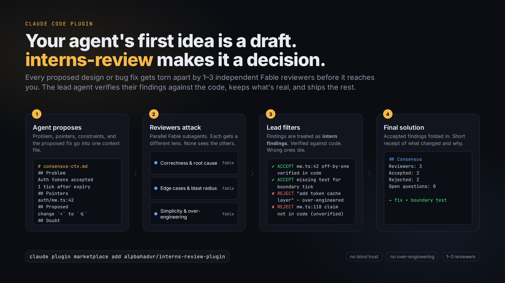

<p align="center">
  
</p>

<h1 align="center">interns-review</h1>

<p align="center">
  <b>Adversarial review for every solution your coding agent proposes.</b><br>
  1–3 independent Fable reviewers tear the idea apart. The lead agent verifies their findings against the code, keeps what's real, and ships the rest.
</p>

<p align="center">
  <a href="#install">Install</a> ·
  <a href="#how-it-works">How it works</a> ·
  <a href="#why">Why</a> ·
  <a href="#other-agents">Other agents</a> ·
  <a href="#tuning">Tuning</a>
</p>

---

## Why

Coding agents are confident. Their first proposal is usually *plausible*, often *incomplete*, and sometimes *wrong* in a way you only discover after it ships.

The usual fix is "ask it to double-check". That doesn't work: the same model, in the same context, with the same blind spots, reviewing its own idea.

**interns-review** changes the shape of the loop:

| Without | With interns-review |
|---|---|
| One model, one pass, one opinion | Lead proposes, independent reviewers attack, lead judges |
| Reviewer sees the whole conversation and inherits its assumptions | Reviewers see only a clean context file and the repo |
| "Looks good to me" | Severity-tagged findings, verified against actual code, or explicitly marked `unverified` |
| Every suggestion gets applied | Findings are **intern findings**: wrong ones are rejected with a reason |
| Reviews drift into refactor proposals | "Do not over-engineer" is a rule for the reviewers *and* the lead |

Result: you get a solution that survived contact with three critics, plus a two-line receipt of what they changed and what was thrown out.

## How it works

Triggered automatically whenever the agent has formed a proposal (design, architecture choice, bug diagnosis + fix, refactor plan). Also manual via `/consensus`.

1. **Context file.** The lead writes one self-contained file: problem, verbatim errors, `path:line` pointers with targeted snippets, constraints, what was already ruled out, the proposed solution, and its own doubts. No conversation history leaks in.

   *Stock Claude Code:* the agent forms a plan in its head and moves straight to editing; there is no written artifact of the problem or the proposal, and nothing another agent could review. *With the plugin:* the hook fires on every prompt, so the moment the agent has a proposal it must stop and externalize it into a file. That file is the only thing the reviewers get, which is what makes their review independent instead of a continuation of the same thought.
2. **Reviewers.** 1–3 `consensus-reviewer` subagents (model: `fable`, read-only tools) run in parallel with the prompt:
   > *Critically review the solution to the problem suggested by our intern. Be critical: review it, verify it against the code, and suggest changes to the solution if it is not good enough. Do not over-engineer.*

   Each gets a different lens: correctness & root cause / edge cases & blast radius / simplicity & over-engineering.

   *Stock Claude Code:* subagents are spawned only when the user asks, and even then the agent usually picks a general-purpose explorer, not a critic. *With the plugin:* a purpose-built `consensus-reviewer` agent exists with a fixed adversarial prompt, read-only tools, and a strict output shape, and the skill spawns one to three of them in parallel automatically, scaled to the stakes. Each gets a different lens so three reviewers do not converge on the same obvious finding.
3. **Filter.** The lead opens the code for every finding. Wrong, out-of-scope, style-only, or over-engineered findings are rejected. Disagreements are settled by the code, not by majority vote. A genuinely simpler alternative from a reviewer wins over the lead's original.

   *Stock Claude Code:* when the agent does get a subagent's report, it tends to fold everything in, because it has no rule telling it to distrust the report. *With the plugin:* the skill hard-codes the intern rule: open the code for every finding, reject the ones that do not hold, keep a one-line reason for each decision. Wrong reviewer findings become rejected lines in the receipt instead of silent changes to your code.
4. **Final solution + receipt.** Reviewers spawned, accepted findings, rejected findings with reasons, open questions only the user can answer.

   *Stock Claude Code:* you get a solution and no trace of what alternatives were considered or why. *With the plugin:* every consensus run ends with a compact receipt of reviewers spawned, findings accepted, findings rejected with reasons, and open questions, so you can override any single decision. The context file is disposable once the receipt exists.

Reviewer count scales with stakes:

| Situation | Reviewers |
|---|---|
| Contained bug fix, low blast radius | 1 |
| Design decision, cross-cutting refactor, unclear root cause | 2 |
| Architecture, data model, security, migrations, irreversible changes | 3 |

Skips automatically for trivial one-liners and pure Q&A. Say **"no consensus"** or **"skip review"** to skip on demand.

## Install

```bash
claude plugin marketplace add alpbahadur/interns-review-plugin
claude plugin install interns-review@interns-review --scope user
```

`--scope user` enables it for every Claude Code session on the machine. Restart open sessions to load it.

## What's in the box

| Path | Purpose |
|---|---|
| `skills/consensus/SKILL.md` | The workflow. Auto-triggers on a proposal; also `/consensus`. |
| `agents/consensus-reviewer.md` | Reviewer subagent: Fable, read-only tools, strict `VERDICT / FINDINGS / ALTERNATIVE` output, ≤60 lines. |
| `hooks/` | Injects the rule at session start and a one-line reminder on every prompt, so long sessions don't forget it. |
| `commands/consensus.md` | `/consensus` slash command. |
| `templates/context.md` | Skeleton for the context file. |
| `AGENTS.md` | The same workflow written for non-Claude agents. |
| `docs/hero.html` | The banner above. Open in a browser and screenshot. |

## Other agents

Not on Claude Code? `AGENTS.md` describes the identical loop in agent-agnostic terms. Drop it into your Codex / Cursor / Gemini CLI instructions and point the reviewer role at the strongest model you have.

## Tuning

- **Reviewer count table:** `skills/consensus/SKILL.md`, Step 2.
- **Reviewer model / tools:** frontmatter in `agents/consensus-reviewer.md`.
- **Reminder wording / skip words:** `hooks/consensus-reminder.sh`.
- **Update after editing:** push, then `claude plugin update interns-review@interns-review`.

## Status

Early. Private for now. Open-sourcing once it has survived a few weeks of real use.
